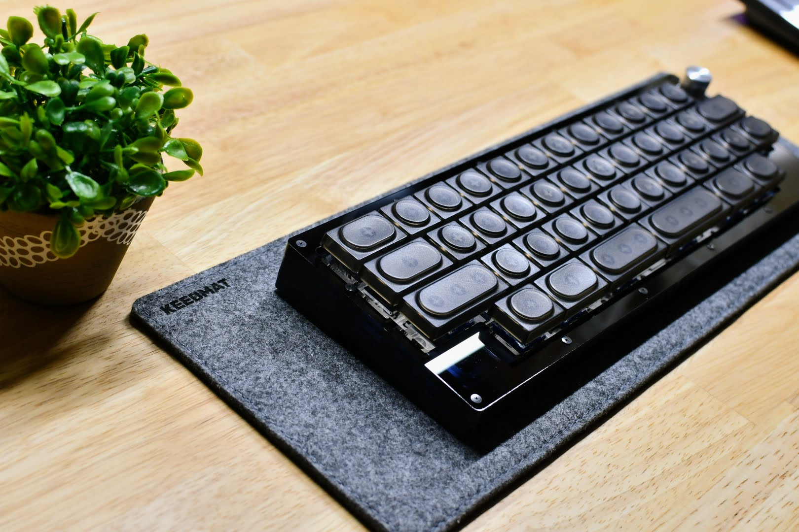
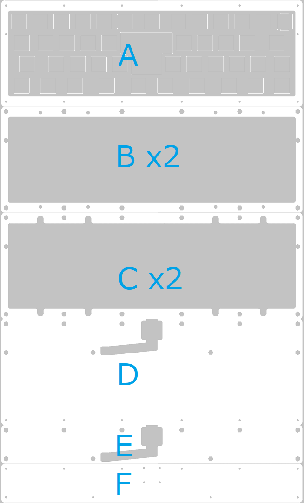

for tad pole pin mount 13.5u case acrylic stacking case

アクリル積層ケース用のSVCファイルです。  
elecrowでの発注を想定しており他のアクリルカットサービスでは使用できない場合があります。  

テストをお願いした河村亮介@Hottyhottea様https://twitter.com/Hottyhotteaに撮影して頂きました。

〇 bally-compatible 2700x4492.zip

aki27様設計のキーボードbally用トッププレートが付属しています。  
elecrow発注時は 外形270.0mm x 449.2mm 厚さは3mmで指定してください。  
価格はアクリルの種類によって $30.30 or $45.46 +送料(2024/01/26現在)でした。  

〇 bally-compatible_hhkb 2700x5442.zip  

上記ケースデータにHHKB仕様のトッププレートデータを追加したものです。  
elecrow発注時は 外形270.0mm x 544.2mm 厚さは3mmで指定してください。  
価格はアクリルの種類によって $36.72 or $55.08 +送料(2024/01/26現在)でした。  

〇 bally-compatible-mid 2700x1900.zip  
破損しやすいミドルプレートのみを抜き出したデータです。  
外形270.0mm x 190.0mm 厚みは同じく3mmです。非常時にご利用ください。

組み立てに必要なもの  

Tadpole pin  
https://geon.works/products/tadpole  
Universal daughter board  
https://www.elecrow.com/unified-c4-daughterboard-and-molex-pico-ezmate-cable.html  
M2 六角スペーサー   
https://www.hirosugi-net.co.jp/shop/c/c11101210/   
　15〜18mm x8  
　10〜12mm x6  
　5〜6mm x2  
M2ワッシャー x2  
M2ネジ  
　6mm x32  
　5mm x2  
　3mm x2  
M2ナット x4  

六角スペーサーの長さに幅があるのはアクリル板の厚みにばらつきが大きいためです。  
アクリル板が押し出し成型の場合、3mm厚を謳うものでも実際には2.5mm〜3.1mm程度とかなりの個体差があります。
アクリル積層ケースでスペーサーを埋め込む場合、この個体差によってスカスカorギチギチというばらつきが出てしまいます。  

本アクリル積層ケースは薄く折れやすい箇所がいくつかあり、各層が密着していないと十分な強度が確保できません。
スペーサーが積層したアクリル板を浮かせないようにわずかに短くなる必要があります。  

そのため実際にレーザーカットサービスが完了し現物が届いてから厚みを採寸、スペーサーの発注をするのが安全だと思います。  
ヒロスギのスペーサーはほぼ0.5mm刻みで用意されており柔軟な対応ができます。  

サンプルではジュラコン製のスペーサーを使用しています。  
本ケースではスペーサーの片側が平面でなくても問題はありませんので、もし注文したスペーサーの長さが間違っていてもカッターナイフやヤスリである程度の長さを調整する事ができます。  
最も長いスペーサーのみを用意して他2サイズを切り出す事も不可能ではないでしょう。  
加工の際はくれぐれも怪我に注意してください。  

組み上げ  
  
使用するのは全部で8枚です。  
映り込み防止の為保護シールが付いたままの状態で撮影していますが、組み上げは保護シールを剥がしてから行って下さい。  

ミドルプレートは両サイドが折れやすく、ドーターボード用ミドルプレートは下面が折れやすいので注意して下さい。  
elecrowは1ショット5枚ずつなので猶予がありますが、それでも4〜5枚折ってしまった場合に備えてミドルプレートのみを追加発注できるようにしてあります。  

１．ドーターボード用ボトムプレートにドーターボードを装着  

M2x6mmネジ4本とM2ナットでドーターボードを取り付けます。  
ナットが内側に入る方が見た目にはすっきりしますが、取り付けの際はドーターボードの実装部品への接触、ドーターボード用ミドルプレートとの干渉に注意が必要です。  
ナットの頂点がドーターボードの縦方向に揃うように取り付けて下さい。  
ケーブルは今後の作業で邪魔になるかもしれませんがここで取り付けます。  

２．ドーターボード用ミドルプレートを重ねる  

二枚を重ねたらボトムプレートの8箇所に16-18mmのスペーサーを立ててネジ止めしていきます。まだネジは本締めしません。後の工程でねじれやセンターずれを起こす恐れがありますので軽く止める程度です。  

３．短い六角スペーサーの準備  

ここで5-6㎜の六角スペーサーを準備します。ネジ山の長さを確保するためここだけ他とは取り付け方法が異なります。  
M2ワッシャーをM2x3mmのネジで取り付けておきます。低頭ネジが望ましいですが皿ネジでも干渉はしないと思います。  
 

４．ボトムプレートの取り付け  

２のプレートの上にボトムプレートを装着します。  
スペーサーのずれでうまく嵌まらない場合は底面のネジを少し緩めてみると良いでしょう。  
重ねられたらプレート中段の2か所に３の工程で作成したスペーサーを取り付けます。この箇所はネジ山の長さが十分でないため若干シビアになります。  
製造時の歪みで若干ずれが生じていますが、ドーターボード取り付け用の切り抜き箇所からミドルプレートを押し出して位置を調整してください。  
底面からネジ止めすればここまでの3枚は固定されます。  

５．ミドルプレート（下）の取り付け  

ここが最も破損しやすい箇所です。  
ミドルプレート（下）を2枚重ねていきます。両側面に薄く割れやすい箇所があるので注意しながら重ねて下さい。  
うまく重なったら下段6カ所にスペーサーを差し込み、裏面から軽くネジ止めします。  

６．PCBの取り付け

PCBに8本のタッドポールピンを差し込み、PCB上のコネクタとドーターボードのケーブルとを接続します。  
ケーブルが長い場合はうまく折り畳んで納めましょう。  

PCBは乗っているだけですのですぐに次の工程に移ります。  

７．ミドルプレート（上）  

タッドポールピンの位置を確認しながらミドルプレート（上）を2枚重ねます。  
タッドポールピンは柔軟なのでずれないよう慎重に行ってください。うまくいかない場合は上からドライバーの先等でつついてやるのもいいでしょう。  

８．トッププレートの取り付け  

7までのケースにトッププレートを重ね、14カ所のネジを取り付けます。  
厚みが物足りない場合はトッププレートを複数枚重ねてください。  

９．ボトムプレートねじの本締め  

最後にボトムプレートのネジ16カ所を本締めして、お好みの箇所にゴム足を張り付けて完了です。  

お疲れ様でした。

